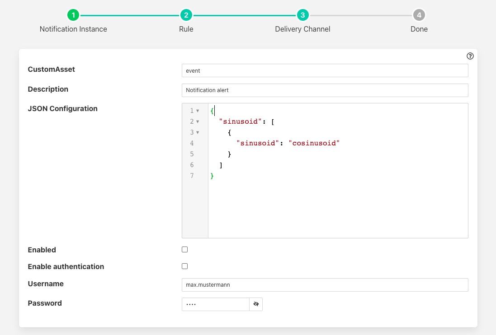

.. Images

Custom Asset Notification
=========================

The *fledge-notify-customasset* notification delivery plugin is a plugin that creates an event asset in the Fledge readings. This event asset can be customised via the configuration and may include data from the asset that triggered the notification.

The asset created will contain a number of data points

  - *description*: A fixed description that is set in the plugin configuration.

  - *event*: The event that caused the asset to be created. This may be one of *triggered* or *cleared*.

  - *rule*: The name of the notification rule that triggered the notification.

  - *store*: The data that triggered the notification.

Once you have created your notification rule and move on to the delivery mechanism

  - Select the *customasset* plugin from the list of plugins

  - Click *Next*

    +-----------+
    | |asset_1| |
    +-----------+

  - Configure the plugin

    - **Custom Asset**: The name of the assert to create

    - **Description**: The content to add in the *description* data point within the asset

    - **JSON Configuration**: This is a description of how to map the asset that triggered the notification to the data in the *store* data point of the event asset.

    - **Enable authentication**: Enable the authentication of the plugin to the Fledge API

    - **Username**: The user name to use when connecting to the Fledge API

    - **Password**: The password to use when connecting to the Fledge API

  - Enable the plugin and click *Next*

  - Complete your notification setup

Store Configuration
-------------------

The content of the *store* data point would normally contain data from the reading that triggered the notification. It will be written as a JSON data point type and will always contain the timestamp of the reading that triggered this notification.

The configuration consists of one or more asset names as a key, the value is an array of objects that defines the data point names to extract from the triggering asset and an alias to use in the store. The example below would include the *sinusoid* asset and the data point within *sinusoid*, also called *sinusoid*. However it would write this value using an alias of *cosinusoid*.

.. code-block:: JSON

   {
      "sinusoid": [
        {
          "sinusoid": "cosinusoid"
        }
      ]
   }

This would result in an asset with a *store* data point that would be as follows

.. code-block:: JSON

   {"sinusoid":{"cosinusoid":0.994521895,"timestamp":"2022-09-08 11:31:29.323666 +0000"}}
